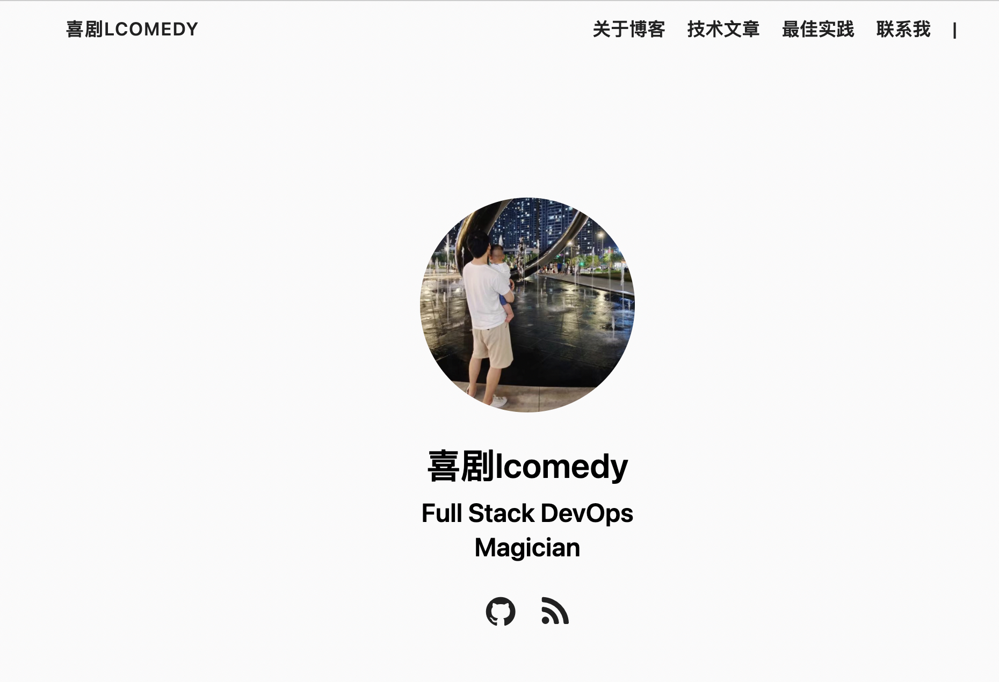

+++
author = "lcomedy"
title = "手把手教你搭建博客网站"
date = "2022-01-01"
description = "通过公有云资源，利用开源工具快速搭建一个自己的个性博客网站"
tags = [
    "blog",
    "hugo",
    "pratice",
    "cicd",
]
categories = [
    "themes",
    "syntax",
]
series = ["博客网站"]
aliases = ["搭建博客网站"]

+++

最近因为工作上的原因，太久没有更新了公众号了。这次来点纯正的干货！手把手教你搭建一个博客网站，看我这一篇就够了。内心OS：主要是年底了，云厂商活动，云服务器太便宜了，我就买了一台服务器，自己玩玩，真香！

## 事前准备

要想搭建一个博客，我们得先提前准备好一些基础设施。

1. 云服务器（花钱，2C4G，8M带宽，222元/3年）
2. 域名（花钱，tech域名，116元/3年）
3. 证书（免费）

整个费用一年112元左右，勉强hold住。另外介绍下我们此次用到了一些软件

1. docker，用于进程管理
2. openresty，用于静态服务器
3. hugo，提供网站渲染功能
4. certbot，提供申请免费证书功能

还有一个最重要的事情，在你购买云服务，和域名后，先别着急搭建。一定先进行域名网上备案，备案通过后，才能在互联网上访问。具体域名备案，可以直接跟着云厂商的备案流程走即可，简单方便。

## 教程

前面的都准备好了，你就可以继续搬砖了。

### hugo安装

```shell
## 下载hugo
wget https://github.com/gohugoio/hugo/releases/download/v0.91.0/hugo_0.91.0_Linux-64bit.tar.gz

tar -xzvf hugo_0.91.0_Linux-64bit.tar.gz

mv hugo /usr/bin/

## 创建一个站点目录
hugo new site /data/hugo-blog/lcomedy

## 下载主题，这里建议下载zip文件到本地，再进行上传操作
cd themes
git clone https://github.com/vjeantet/hugo-theme-casper.git casper


## 编译,生成public文件
cd /data/hugo-blog/lcomedy
hugo --baseUrl="/" -t casper

## 如果你想在本地调试
hugo server -t casper -D

```

### 搭建静态服务器

静态页面，我们需要一个webserver对外提供服务。这里我使用openrestry作为我的静态服务器，采用docker进行部署安装。

先安装docker服务

```shell
yum install -y docker
```

配置镜像代理，加速镜像拉取

/etc/docker/daemon.json

```shell
  {
    "registry-mirrors": ["https://registry.docker-cn.com"]
  }
```

openrestry安装

```shell
docker pull openresty
```

配置/etc/nginx/conf.d/hugo.conf

```nginx
server
{
  listen 80;
  # 配置证书后，再取消注释
  # listen 443 ssl;

  #域名
  server_name blog.lcomedy.tech;

  ## https的证书路径，配置证书后再取消注释
  # ssl_certificate /etc/letsencrypt/live/blog.lcomedy.tech/fullchain.pem;
  # ssl_certificate_key /etc/letsencrypt/live/blog.lcomedy.tech/privkey.pem;
  # ssl_ciphers ECDHE-RSA-AES128-GCM-SHA256:HIGH:!aNULL:!MD5:!RC4:!DHE;
  # ssl_prefer_server_ciphers  on;
  # ssl_session_cache    shared:SSL:1m;
  # ssl_session_timeout  5m;

  index index.html index.htm index.php;

  location / {
    root /data/hugo-blog/lcomedy/public;
  }
}
```

创建对应目录，根据nginx的配置，后续启动服务的时候需要使用到。

```shell
mkdir /data && mkdir /etc/letsencrypt && mkdir /etc/nginx/conf.d
```

启动服务，记得使用本地网络。

```shell
docker run --name openrestry --network=host -v /etc/nginx/conf.d:/etc/nginx/conf.d -v /etc/letsencrypt:/etc/letsencrypt -v /data:/data -d openresty/openresty
```

启动成功后，我们网站就搭建成功了。

## 网站证书配置

网上签发免费证书的方式，我这里选择的是certbot。首先我们需要先安装这cerbot的工具。

```shell
yum install certbot python2-certbot-nginx -y
```

在配置网站证书之前，我们为了保证我们证书能够成功申请，我采取使用网站验证的方式。我们要先完成如下几步：

1. 拥有一个域名，并在该域名服务器创建一条A记录，指向云主机的公网IP地址。
2. 确保该域名能够被DNS解析到，方式是ping blog.lcomedy.tech，是否能够解析到IP地址。

确认以上步骤后，使用certbot进行创建证书。这里会进行一些证书的选择

```shell
## 执行命令后，需要输入一些证书相关信息
certbot certonly
```

1. 选择网站类型，我了选择2

2. 输入域名，我输入的是blog.lcomedy.tech

3. 输入静态文件目录，我的输入是/data/hugo-blog/lcomedy/public/

4. 证书文件所在目录/etc/letsencrypt/live/blog.lcomedy.tech

证书的验证方式实际上是，certbot会生成随机文件到给定目录(nginx配置的网页目录)下的/.well-known/acme-challenge/目录里面，并通过已经启动的nginx验证随机文件，最终生成证书。

证书生成后，为了保证后续证书不过期，我们可以加一个定时更新证书的脚本

```shell
python -c 'import random; import time; time.sleep(random.random() * 3600)' && certbot renew -q" | sudo tee -a
```

```
echo "0 0,12 * * * root python -c 'import random; import time; time.sleep(random.random() * 3600)' && certbot renew -q" | sudo tee -a /etc/crontab > /dev/null
```

最终的证书生成地址在 /etc/letsencrypt/live/blog.lcomedy.tech 目录下。

/etc/nginx/conf.d/hugo.conf该配置文件，取消之前配置证书的注释，重启nginx

```
docker restart openrestry
```

我们就能看到自己的博客了！

这个是我的博客地址：https://blog.lcomedy.tech



## 参考网站

[hugo中文网站](https://www.gohugo.org/)

[网站证书](https://www.cnblogs.com/sage-blog/p/10302934.html)

[Coder主题配置](https://github.com/luizdepra/hugo-coder/wiki/Configurations)

## 关注我，下期更精彩

后续我将给大家介绍

1. 如何对这个博客进行装修，让每个人都能打造一个自己个性的博客。让博客看起来爽一点。

2. 如何高效的来进行网站的文章发布。让博客写起来爽一点。